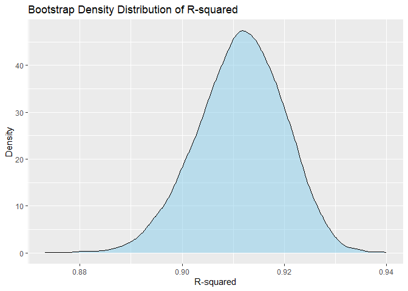
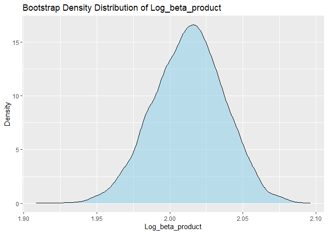
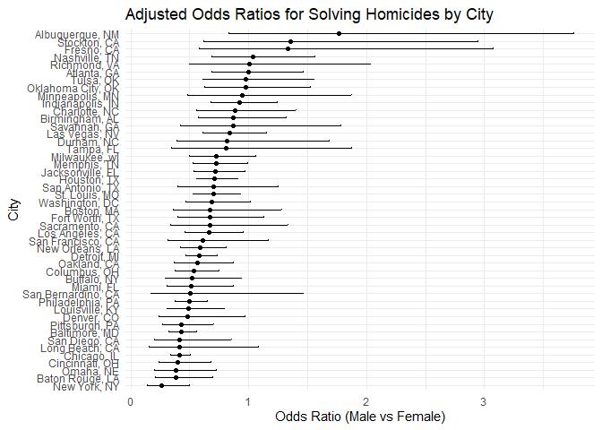
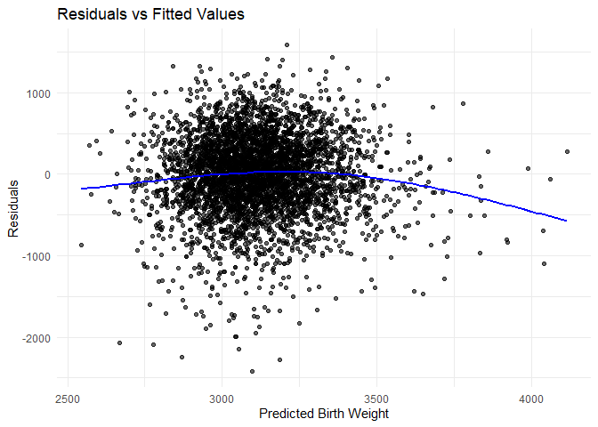
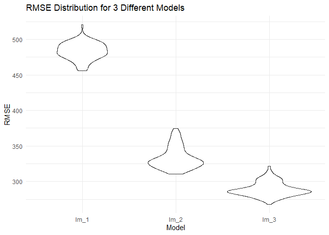

TEST_p8105_hw6
================
2024-12-2

``` r
library(tidyverse)
library(modelr)

set.seed(1202)
```

# Problem 1

``` r
weather_df = 
  rnoaa::meteo_pull_monitors(
    c("USW00094728"),
    var = c("PRCP", "TMIN", "TMAX"), 
    date_min = "2017-01-01",
    date_max = "2017-12-31") |>
  mutate(
    name = recode(id, USW00094728 = "CentralPark_NY"),
    tmin = tmin / 10,
    tmax = tmax / 10) |>
  select(name, id, everything())
```

    ## using cached file: C:\Users\CC\AppData\Local/R/cache/R/rnoaa/noaa_ghcnd/USW00094728.dly

    ## date created (size, mb): 2024-12-01 20:39:19.95446 (8.685)

    ## file min/max dates: 1869-01-01 / 2024-11-30

### 1. A simple linear regression with tmax as the response and tmin as the predictor

``` r
lm_fit <- lm(tmax ~ tmin, data = weather_df)
```

### 2. Use 5000 bootstrap samples and produce estimates of $\hat{r}^2$ and $\log(\hat{\beta}_0 * \hat{\beta}_1)$

``` r
bootstrap_function <- function(data) {
  boot_sample <- sample_frac(data, replace = TRUE)
  
  boot_fit <- lm(tmax ~ tmin, data = boot_sample)

  glance_result <- broom::glance(boot_fit)
  r_squared <- glance_result$r.squared
  
  beta <- coef(boot_fit)
  log_beta_product <- log(beta[1] * beta[2])
  
  return(tibble(
    r_squared = r_squared, 
    log_beta_product = log_beta_product))
}
```

``` r
boot_straps_1 <- tibble(strap_number = 1:5000) |>
  mutate(
    strap_sample = map(strap_number, \(i) bootstrap_function(weather_df))
  ) |>
  unnest(strap_sample)

head(boot_straps_1, 5)
```

    ## # A tibble: 5 × 3
    ##   strap_number r_squared log_beta_product
    ##          <int>     <dbl>            <dbl>
    ## 1            1     0.916             2.04
    ## 2            2     0.910             2.00
    ## 3            3     0.900             2.02
    ## 4            4     0.923             2.01
    ## 5            5     0.909             2.04

### 3. Plot the distribution of estimates

``` r
ggplot(boot_straps_1, aes(x = r_squared)) +
  geom_density(color = "black", fill = "skyblue", alpha = 0.5) +
  labs(
    title = "Bootstrap Density Distribution of R-squared",
    x = "R-squared",
    y = "Density"
  )
```

<!-- -->

``` r
ggplot(boot_straps_1, aes(x = log_beta_product)) +
  geom_density(color = "black", fill = "skyblue", alpha = 0.5) +
  labs(
    title = "Bootstrap Density Distribution of Log_beta_product",
    x = "Log_beta_product",
    y = "Density"
  )
```

<!-- -->

**Description:**  
- $\hat{r}^2$: The distribution is bell-shaped, centered around 0.91,
indicating that most R-squared estimates are concentrated near this
value.  
- $\log(\hat{\beta}_0 * \hat{\beta}_1)$: The distribution is
bell-shaped, centered around 2.02, indicating that most log estimates
are concentrated near this value.

### 4. Identify the 2.5% and 97.5% quantiles to provide a 95% confidence interval for $\hat{r}^2$ and $\log(\hat{\beta}_0 * \hat{\beta}_1)$

``` r
ci_r_squared <- quantile(boot_straps_1$r_squared, c(0.025, 0.975))
ci_log_beta_product <- quantile(boot_straps_1$log_beta_product, c(0.025, 0.975))

ci_r_squared
```

    ##      2.5%     97.5% 
    ## 0.8939925 0.9269135

``` r
ci_log_beta_product
```

    ##     2.5%    97.5% 
    ## 1.964846 2.058595

- CI of r_squared: (0.8939448, 0.9271188)  
- CI of log_beta_product: (1.964509, 2.058203)

# Problem 2

``` r
homicide_data <- read_csv("./data/homicide-data.csv")
```

    ## Rows: 52179 Columns: 12
    ## ── Column specification ────────────────────────────────────────────────────────
    ## Delimiter: ","
    ## chr (9): uid, victim_last, victim_first, victim_race, victim_age, victim_sex...
    ## dbl (3): reported_date, lat, lon
    ## 
    ## ℹ Use `spec()` to retrieve the full column specification for this data.
    ## ℹ Specify the column types or set `show_col_types = FALSE` to quiet this message.

### 1. Create variables, omit variables, convert victim_age

``` r
homicide_data_tidy <- homicide_data |>
  mutate(city_state = str_c(city, state, sep = ", "), 
         resolved = ifelse(disposition == "Closed by arrest", 1, 0)) |>
  filter(!city_state %in% c("Dallas, TX", "Phoenix, AZ", "Kansas City, MO", "Tulsa, AL"),
         victim_race %in% c("White", "Black")) |>
  mutate(victim_age = as.numeric(victim_age))

head(homicide_data_tidy, 5)
```

    ## # A tibble: 5 × 14
    ##   uid   reported_date victim_last victim_first victim_race victim_age victim_sex
    ##   <chr>         <dbl> <chr>       <chr>        <chr>            <dbl> <chr>     
    ## 1 Alb-…      20100601 SATTERFIELD VIVIANA      White               15 Female    
    ## 2 Alb-…      20100102 MULA        VIVIAN       White               72 Female    
    ## 3 Alb-…      20100126 BOOK        GERALDINE    White               91 Female    
    ## 4 Alb-…      20100130 MARTIN-LEY… GUSTAVO      White               56 Male      
    ## 5 Alb-…      20100218 LUJAN       KEVIN        White               NA Male      
    ## # ℹ 7 more variables: city <chr>, state <chr>, lat <dbl>, lon <dbl>,
    ## #   disposition <chr>, city_state <chr>, resolved <dbl>

### 2. Glm: resolved vs unresolved - victim age, sex and race in Baltimore, MD

a logistic regression:

``` r
baltimore_data <- homicide_data_tidy |>
  filter(city_state == "Baltimore, MD")

baltimore_glm <- glm(resolved ~ victim_age + victim_sex + victim_race, 
                     data = baltimore_data, 
                     family = binomial)

baltimore_results <- broom::tidy(baltimore_glm)

baltimore_results
```

    ## # A tibble: 4 × 5
    ##   term             estimate std.error statistic  p.value
    ##   <chr>               <dbl>     <dbl>     <dbl>    <dbl>
    ## 1 (Intercept)       0.310     0.171        1.81 7.04e- 2
    ## 2 victim_age       -0.00673   0.00332     -2.02 4.30e- 2
    ## 3 victim_sexMale   -0.854     0.138       -6.18 6.26e-10
    ## 4 victim_raceWhite  0.842     0.175        4.82 1.45e- 6

obtain the estimate and confidence interval of the adjusted odds ratio
for solving homicides comparing male victims to female victims, keeping
all other variables fixed:

``` r
male_vs_female_results <- baltimore_results |>
  filter(term == "victim_sexMale") |>
  mutate(
    odds_ratio = exp(estimate),
    conf_low = exp(estimate - 1.96 * std.error),
    conf_high = exp(estimate + 1.96 * std.error)
  ) |>
  select(term, odds_ratio, conf_low, conf_high)

male_vs_female_results
```

    ## # A tibble: 1 × 4
    ##   term           odds_ratio conf_low conf_high
    ##   <chr>               <dbl>    <dbl>     <dbl>
    ## 1 victim_sexMale      0.426    0.325     0.558

### 3. Apply the above steps to each of the cities

``` r
city_or_results <- homicide_data_tidy |>
  group_by(city_state) |>
  nest() |>
  mutate(
    glm_fit = map(data, \(x) glm(resolved ~ victim_age + victim_sex + victim_race, data = x, family = binomial)),
    
    glm_tidied = map(glm_fit, \(x) broom::tidy(x)),
    
    or_results = map(glm_tidied, \(x) x |>
      filter(term == "victim_sexMale") |>
      mutate(
        odds_ratio = exp(estimate),
        conf_low = exp(estimate - 1.96 * std.error),
        conf_high = exp(estimate + 1.96 * std.error)
      )
    )
  ) |>
  unnest(cols = c(or_results)) |>
  select(city_state, odds_ratio, conf_low, conf_high)

head(city_or_results, 5)
```

    ## # A tibble: 5 × 4
    ## # Groups:   city_state [5]
    ##   city_state      odds_ratio conf_low conf_high
    ##   <chr>                <dbl>    <dbl>     <dbl>
    ## 1 Albuquerque, NM      1.77     0.831     3.76 
    ## 2 Atlanta, GA          1.00     0.684     1.46 
    ## 3 Baltimore, MD        0.426    0.325     0.558
    ## 4 Baton Rouge, LA      0.381    0.209     0.695
    ## 5 Birmingham, AL       0.870    0.574     1.32

### 4. Create a plot that shows the estimated ORs and CIs for each city.

``` r
ggplot(city_or_results, aes(x = reorder(city_state, odds_ratio), y = odds_ratio)) +
  geom_point() +
  geom_errorbar(aes(ymin = conf_low, ymax = conf_high), width = 0.2) +
  coord_flip() +
  labs(
    title = "Adjusted Odds Ratios for Solving Homicides by City",
    x = "City",
    y = "Odds Ratio (Male vs Female)"
  ) +
  theme_minimal()
```

<!-- -->

**Comment:**  
- Most cities have odds ratios between 0.5 and 1, indicating that in
these cities, male victims’ cases are generally solved at a lower rate
compared to female victims.  
- The width of the confidence intervals varies across cities, reflecting
differences in data quantity and uncertainty. Some cities have very wide
confidence intervals, indicating high uncertainty in the estimates.

# Problem 3

### 1. Load and clean the data for regression analysis

``` r
birthweight_data <- read_csv("./data/birthweight.csv")
```

    ## Rows: 4342 Columns: 20
    ## ── Column specification ────────────────────────────────────────────────────────
    ## Delimiter: ","
    ## dbl (20): babysex, bhead, blength, bwt, delwt, fincome, frace, gaweeks, malf...
    ## 
    ## ℹ Use `spec()` to retrieve the full column specification for this data.
    ## ℹ Specify the column types or set `show_col_types = FALSE` to quiet this message.

``` r
birthweight_data_tidy <- birthweight_data |>
  mutate(
    babysex = factor(babysex, levels = c(1, 2), labels = c("Male", "Female")),
    frace = factor(frace, levels = c(1, 2, 3, 4, 8, 9), labels = c("White", "Black", "Asian", "Puerto Rican", "Other", "Unknown")),
    mrace = factor(mrace, levels = c(1, 2, 3, 4, 8), labels = c("White", "Black", "Asian", "Puerto Rican", "Other")),
    malform = factor(malform, levels = c(0, 1), labels = c("Absent", "Present"))
  ) |>
  drop_na()

head(birthweight_data_tidy, 5)
```

    ## # A tibble: 5 × 20
    ##   babysex bhead blength   bwt delwt fincome frace gaweeks malform menarche
    ##   <fct>   <dbl>   <dbl> <dbl> <dbl>   <dbl> <fct>   <dbl> <fct>      <dbl>
    ## 1 Female     34      51  3629   177      35 White    39.9 Absent        13
    ## 2 Male       34      48  3062   156      65 Black    25.9 Absent        14
    ## 3 Female     36      50  3345   148      85 White    39.9 Absent        12
    ## 4 Male       34      52  3062   157      55 White    40   Absent        14
    ## 5 Female     34      52  3374   156       5 White    41.6 Absent        13
    ## # ℹ 10 more variables: mheight <dbl>, momage <dbl>, mrace <fct>, parity <dbl>,
    ## #   pnumlbw <dbl>, pnumsga <dbl>, ppbmi <dbl>, ppwt <dbl>, smoken <dbl>,
    ## #   wtgain <dbl>

### 2. Propose a regression model for birthweight

``` r
bw_lm_1 <- lm(bwt ~ delwt + wtgain + mheight, data = birthweight_data_tidy)

summary(bw_lm_1)
```

    ## 
    ## Call:
    ## lm(formula = bwt ~ delwt + wtgain + mheight, data = birthweight_data_tidy)
    ## 
    ## Residuals:
    ##      Min       1Q   Median       3Q      Max 
    ## -2416.56  -279.42    25.18   311.11  1582.79 
    ## 
    ## Coefficients:
    ##             Estimate Std. Error t value Pr(>|t|)    
    ## (Intercept) 969.8182   178.3360   5.438 5.68e-08 ***
    ## delwt         3.8855     0.4040   9.617  < 2e-16 ***
    ## wtgain        7.9612     0.7481  10.642  < 2e-16 ***
    ## mheight      22.0996     3.0612   7.219 6.14e-13 ***
    ## ---
    ## Signif. codes:  0 '***' 0.001 '**' 0.01 '*' 0.05 '.' 0.1 ' ' 1
    ## 
    ## Residual standard error: 482.6 on 4338 degrees of freedom
    ## Multiple R-squared:  0.1126, Adjusted R-squared:  0.112 
    ## F-statistic: 183.5 on 3 and 4338 DF,  p-value: < 2.2e-16

**Modeling process:**  
- This model uses hypothesized factors that could influence birth
weight, including delivery weight (delwt), mother’s weight gain during
pregnancy (wtgain) and maternal height (mheight).  
- A linear regression model was fitted using these predictors, using the
formula: *bwt ~ momage + delwt + mheight*.

### 3. A plot of model residuals against fitted values

``` r
birthweight_lm1 <- birthweight_data_tidy |>
  add_predictions(bw_lm_1, var = "predicted_bwt") |>
  add_residuals(bw_lm_1, var = "residuals")

ggplot(birthweight_lm1, aes(x = predicted_bwt, y = residuals)) +
  geom_point(alpha = 0.6) +
  geom_smooth(method = "loess", se = FALSE, color = "blue") +
  labs(
    title = "Residuals vs Fitted Values",
    x = "Predicted Birth Weight",
    y = "Residuals"
  ) +
  theme_minimal()
```

    ## `geom_smooth()` using formula = 'y ~ x'

<!-- -->

### 4. Compare 3 models in terms of the cross-validated prediction error

``` r
cv_splits <- crossv_mc(birthweight_data_tidy, 100)

cv_df <- crossv_mc(birthweight_data_tidy, 100) |>
  mutate(
    train = map(train, as_tibble),
    test = map(test, as_tibble)
  )

cv_df <- cv_df |>
  mutate(
    
    lm_1 = map(train, ~ lm(bwt ~ delwt + wtgain + mheight, data = .x)),
    
    lm_2 = map(train, ~ lm(bwt ~ blength + gaweeks, data = .x)),
    
    lm_3 = map(train, ~ lm(bwt ~ bhead * blength * babysex, data = .x)),
    
    rmse_lm_1 = map2_dbl(lm_1, test, ~ {
      predictions <- add_predictions(.y, .x)
      sqrt(mean((predictions$bwt - predictions$pred)^2, na.rm = TRUE))
    }),
    
    rmse_lm_2 = map2_dbl(lm_2, test, ~ {
      predictions <- add_predictions(.y, .x)
      sqrt(mean((predictions$bwt - predictions$pred)^2, na.rm = TRUE))
    }),
    
    rmse_lm_3 = map2_dbl(lm_3, test, ~ {
      predictions <- add_predictions(.y, .x)
      sqrt(mean((predictions$bwt - predictions$pred)^2, na.rm = TRUE))
    })
  )

rmse_results <- cv_df |>
  select(starts_with("rmse_")) |>
  pivot_longer(
    everything(),
    names_to = "model",
    values_to = "rmse",
    names_prefix = "rmse_"
  ) |>
  mutate(model = fct_inorder(model))

ggplot(rmse_results, aes(x = model, y = rmse)) +
  geom_violin() +
  labs(
    title = "RMSE Distribution for 3 Different Models",
    x = "Model",
    y = "RMSE"
  ) +
  theme_minimal()
```

<!-- -->

- Model 1 (lm_1) has a relatively high RMSE, approximately between 450
  and 500, indicating a higher prediction error.  
- Model 2 (lm_2) has a lower RMSE compared to Model 1, around 350,
  suggesting it performs better than Model 1.  
- Model 3 (lm_3) has the lowest RMSE, around 300, with a concentrated
  distribution, implying the best prediction capability and stability
  among the three models.
